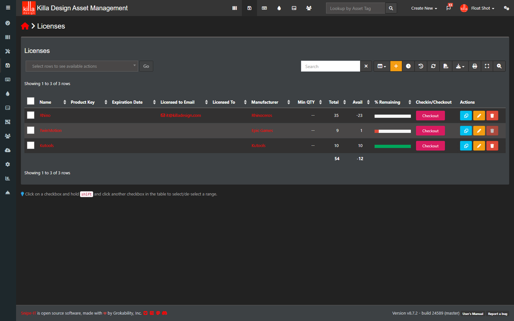
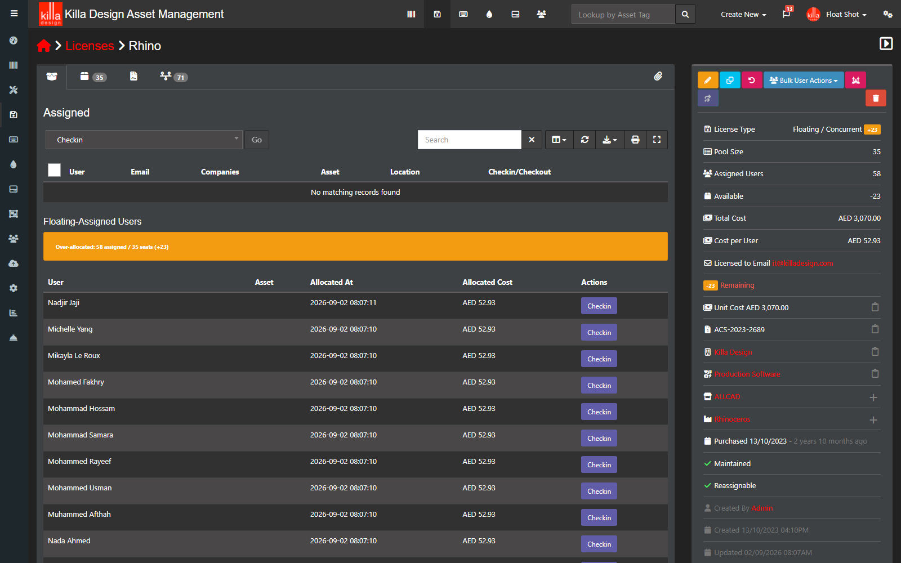
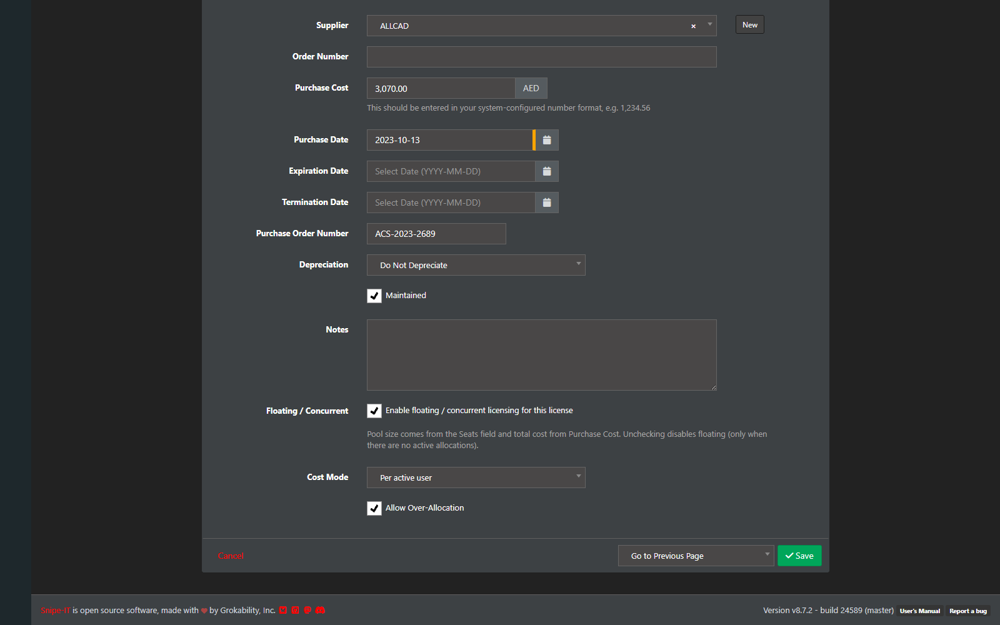
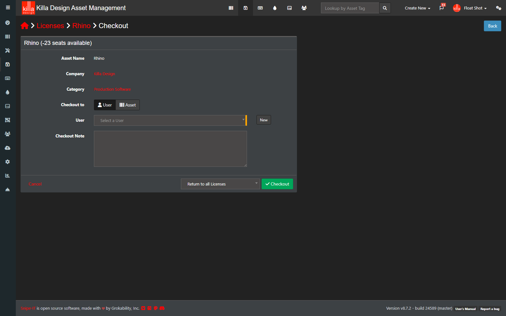
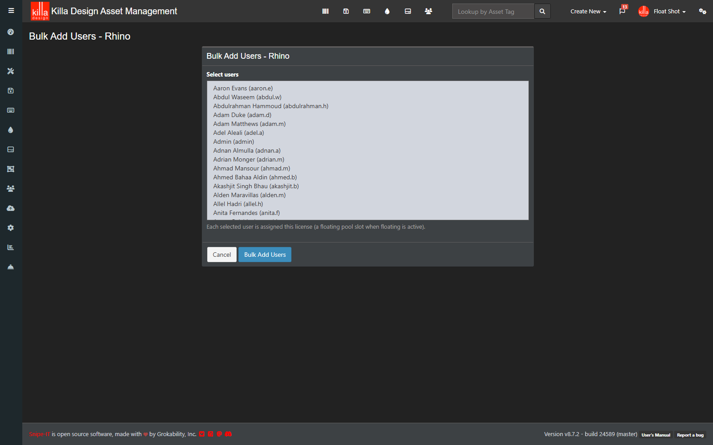
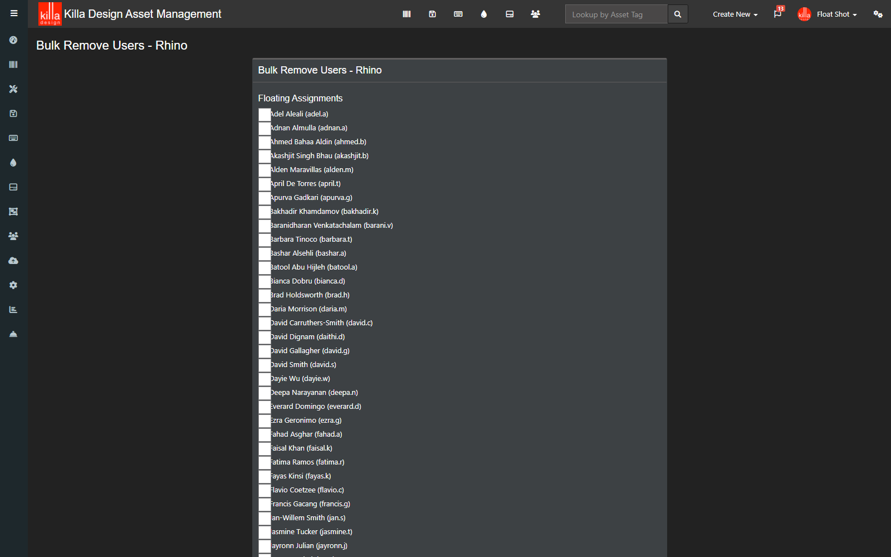
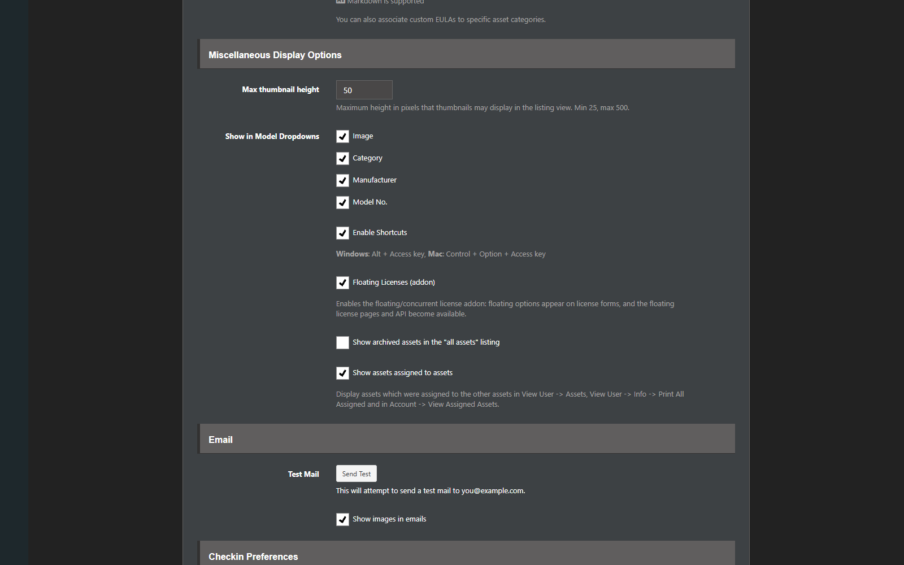

# Snipe-IT Floating License Plugin

Adds floating / concurrent software license pools to Snipe-IT: a license's
seat count becomes a pool of concurrent-use slots that any number of users can
share, with the license cost spread across the people actually using it —
the Enscape-style case (17 seats, 35 users, everyone shares, cost split across
all 35).

> **Notice: this plugin's code was AI-generated** (with human review and a
> passing test suite of 105 tests). It is provided **as-is, use at your own
> risk / use as needed**. Test it on a staging copy of your Snipe-IT before
> deploying to production.

## Features

- **Floating / concurrent pools** attached 1:1 to existing licenses —
  `licenses.seats` is the pool size, `licenses.purchase_cost` the total cost.
- **Master switch** in Admin → Settings → General ("Floating Licenses
  (addon)"). When ON, *every* license behaves floating (a default pool config
  is lazily created from the license's own attributes); when OFF the addon is
  fully inert (UI hidden, web/API routes 403).
- **Per-license toggle** on the license edit form to customize cost mode /
  over-allocation (and to keep a config if the master switch is later turned
  off).
- **Over-allocation** support (on by default for floating-enabled licenses):
  more concurrent users than seats, with clear over-allocation indicators.
- **Cost distribution modes**: `pool_slot` (fixed price per slot) and
  `active_user` (total cost spread across currently active users).
- **Bulk add / bulk remove users** on the license page — for floating licenses
  (allocations) and fixed licenses (real core seat checkout/checkin, mixed
  state handled).
- **Single-checkout interception**: core's normal checkout flow on a floating
  license allocates a pool slot instead of occupying a seat record; the
  checkout page shows floating-aware availability and an exhaustion callout.
- **Availability-aware UI**: licenses index `Avail`/`% Remaining`, the license
  info panel "Remaining" row, and per-seat checkout buttons are all corrected
  for floating pools.
- **Audit logging** into Snipe-IT's standard activity report, REST API
  endpoints, optional lease durations/expiration (`floating-licenses:expire`).

## Screenshots

| | |
|---|---|
| Licenses list — Avail goes negative when over-allocated |  |
| License view — info panel rows + over-allocation label |  |
| Floating-assigned users + per-user Checkin + over-allocation alert |  |
| License edit — Floating / Concurrent section |  |
| Checkout page — floating-aware availability + exhaustion callout |  |
| Bulk Add Users |  |
| Bulk Remove Users |  |
| Admin master switch |  |

## Requirements

- Snipe-IT **v8.x** (developed and tested against **v8.7.2** live and current
  `develop`)
- PHP **>= 8.2**
- No additional Composer packages beyond Snipe-IT's own

## Installation

### Git checkout of Snipe-IT

```bash
cd /path/to/snipe-it

# 1. Copy the package in
mkdir -p packages
cp -r /path/to/snipe-it-floating-license-plugin/package packages/floating-licenses

# 2. Wire composer.json (or run install.sh, which does 1+2+3 for you):
#    - add a path repository { "type": "path", "url": "packages/floating-licenses", "options": { "symlink": true } }
#    - add "snipe-it/floating-licenses": "@dev" to "require"
#    - add "SnipeIt\\FloatingLicenses\\Tests\\": "packages/floating-licenses/tests/"
#      to "autoload-dev" → "psr-4" (only needed to run the test suite)

# 3. Apply the core patches
git apply /path/to/snipe-it-floating-license-plugin/core-patches/01-licenses-controller.patch
# ... etc. If a patch fails, core-patches/README.md shows each small manual
# edit with its anchor. Apply 02 OR 02b depending on your checkout field names:
grep -n "assigned_to" app/Http/Controllers/Licenses/LicenseCheckoutController.php
# assigned_to present (v8.7.2) → 02b; assigned_user (develop) → 02

# 4. Register the package
composer update snipe-it/floating-licenses --no-interaction
# If composer fails on github.com authentication:
#   composer config use-github-api false
#   composer update snipe-it/floating-licenses --no-interaction

# 5. Migrate + clear caches
php artisan migrate --force
php artisan optimize:clear
```

Or let the helper do steps 1–3:

```bash
/path/to/snipe-it-floating-license-plugin/install.sh /path/to/snipe-it
```

The package can also live anywhere on disk — point the composer `path`
repository's `url` at it instead of copying.

### Manual / zip install (no git)

Copy `package/` into `packages/floating-licenses`, edit `composer.json` as in
step 2 above, and make the eleven core edits by hand — `core-patches/README.md`
lists every hunk with its anchor text. Then steps 4–6 as above.

### Docker

Mount or copy the package into the container and apply the core edits in your
image build, then run the same steps inside the container, e.g.:

```dockerfile
COPY snipe-it-floating-license-plugin/package /var/www/html/packages/floating-licenses
# apply core edits (COPY pre-patched files or RUN patch) — see core-patches/README.md
RUN composer update snipe-it/floating-licenses --no-interaction
```

Migrations run at container start (`php artisan migrate --force`) as usual for
Snipe-IT Docker deployments.

### Post-install

1. **Admin → Settings → General → "Floating Licenses (addon)"** — turn the
   master switch on.
2. Grant the six `floating_licenses.*` permissions to your groups (they appear
   under a "Floating Licenses" section on the group/user permission pages).

## Usage

### Enable floating on a license

With the master switch on, every license already behaves floating using its
own Seats/Purchase Cost. To customize, edit the license: the **Floating /
Concurrent** section offers an enable checkbox, a cost-mode select, and an
over-allocation checkbox. Pool size and total cost always come from the
license's own fields. Unchecking soft-deletes the config (only while no
allocations are active).

### Assigning users

- **Bulk User Actions** dropdown on the license page: *Bulk Add Users* /
  *Bulk Remove Users*. Floating licenses create/release allocations; fixed
  licenses use the exact core seat checkout/checkin mechanism (a license in a
  mixed state — floating allocations plus legacy seat checkouts — is cleaned
  up by one bulk-remove).
- **Single checkout** via core's checkout button allocates a pool slot (no
  seat record); a full pool without over-allocation refuses with an error.
- **Checkin** per floating user from the Assigned tab's floating table.

### Cost modes (the Enscape example)

A $total-cost pool shared by N active users:

- `active_user` — cost spread across active users. 17-seat pool, $X purchase
  cost, 35 users assigned → each active allocation carries $X/35. Recalculated
  on every allocate/release.
- `pool_slot` — fixed $X/pool_size per allocation regardless of usage.

### Over-allocation

When allowed, allocations may exceed the pool size. The UI flags this
("Over-allocated: 46 assigned / 35 seats (+11)") in the Assigned tab, the info
panel, and the licenses index (Avail goes negative). It is purely
informational — nothing is blocked.

## API endpoints

Under `/api/v1/`, standard Snipe-IT token auth and response envelope; 403
while the master switch is off.

| Method | Endpoint | Permission | Description |
|---|---|---|---|
| `POST` | `/api/v1/floating-licenses/{license}/allocate` | `floating_licenses.allocate` | Allocate a slot. Body: `user_id` (required), `asset_id`, `notes`. 422 when the pool is exhausted. |
| `GET` | `/api/v1/floating-licenses/{license}/availability` | `floating_licenses.view` | Pool stats incl. `over_allocated` / `excess`. |
| `POST` | `/api/v1/floating-license-allocations/{allocation}/heartbeat` | own (`allocate`) or `release` | Extend the lease (no-op for pools without a lease duration). |
| `POST` | `/api/v1/floating-license-allocations/{allocation}/release` | own (`allocate`) or `release` | Release the slot. |

## Commands

| Command | Purpose |
|---|---|
| `php artisan floating-licenses:expire` | Expire stale allocations. Only pools that have lease/idle durations set are affected; schedule it (e.g. `$schedule->command('floating-licenses:expire')->everyFiveMinutes();` in `app/Console/Kernel.php`) only if you use durations. Durations are null (never expire) by default. |

## Permissions

| Permission | Grants |
|---|---|
| `floating_licenses.view` | Pool list/detail pages; API availability. |
| `floating_licenses.manage` | Enable/edit/disable pool configurations. |
| `floating_licenses.allocate` | Allocate; bulk-add; release/heartbeat **own** allocations. |
| `floating_licenses.release` | Release/heartbeat **any** allocation; bulk-remove. |
| `floating_licenses.costs` | Cost visibility (totals, per-user costs). |
| `floating_licenses.history` | Allocation history panel. |

## Audit events

`floating.allocate` / `floating.release` / `floating.revoke` /
`floating.expire` / `floating.heartbeat` / `floating.capacity_exceeded` rows
in `action_logs` (visible in the standard activity report); bulk operations on
fixed licenses log normal core `checkout`/`checkin` entries.

## Core modifications

Nine small, guarded edits (full details + anchors in `core-patches/README.md`):

| Core file | Change |
|---|---|
| `app/Http/Controllers/Licenses/LicensesController.php` | One sync call in `store()` and `update()`. |
| `app/Http/Controllers/Licenses/LicenseCheckoutController.php` | Floating interception hunk at the top of `store()` (02 = develop field names, 02b = v8.7.2 field names). |
| `app/Http/Controllers/SettingsController.php` | One line in `postSettings()`. |
| `app/Http/Transformers/LicensesTransformer.php` | Floating-aware avail/percent in the licenses index (2 grouped queries, no N+1). |
| `app/Http/Transformers/LicenseSeatsTransformer.php` | Suppress per-seat checkout for floating licenses. |
| `resources/views/licenses/edit.blade.php` | Floating section in the license form. |
| `resources/views/licenses/view.blade.php` | Info rows, floating-users table + checkin buttons, bulk dropdown, Available-tab callout, Remaining-row override. |
| `resources/views/licenses/checkout.blade.php` | Floating-aware availability + exhaustion callout. |
| `resources/views/settings/general.blade.php` | Master-switch checkbox. |

**Upgrade/re-apply:** after a Snipe-IT upgrade, take upstream versions of
conflicting files and re-apply the matching patch or manual hunk
(`// [floating-licenses addon] BEGIN/END` markers), then
`composer update snipe-it/floating-licenses && php artisan migrate --force &&
php artisan optimize:clear`.

## Uninstall

1. `php artisan migrate:rollback --path=packages/floating-licenses/database/migrations`
   (**drops the floating tables' data** and the settings column).
2. Remove the eleven core edits (reverse the patches: `git apply -R`).
3. Remove the composer.json entries (path repository, `require`,
   `autoload-dev` mapping) and `packages/floating-licenses`.
4. `composer update snipe-it/floating-licenses --no-interaction && php artisan optimize:clear`

Fixed-seat licenses, seats, and history are never touched.

## Testing

The suite (105 tests, 347 assertions as of writing) runs against the host
Snipe-IT's test-suite conventions (`LazilyRefreshDatabase`, factories,
`actingAsForApi()`). With the `autoload-dev` mapping installed:

```bash
vendor/bin/phpunit --testsuite FloatingLicenses
```

Note: the checkout-interception tests assume the v8.x request field name
`assigned_to`. When testing against `develop` (which uses `assigned_user`),
adjust with:

```bash
sed -i "s/'assigned_to' =>/'assigned_user' =>/" packages/floating-licenses/tests/Feature/FloatingCheckoutInterceptionTest.php
```

(run the reverse when targeting v8.7.2 from a develop-based tree).

## License

Same as Snipe-IT: **AGPL-3.0**.
